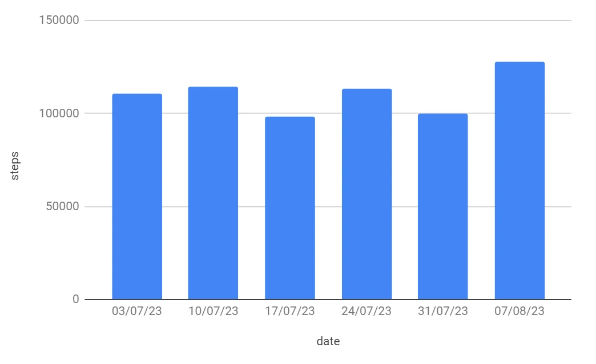

DexQL is a query language to query a dataset and create a dashboard from the data. It is based on [Kusto Query Language](https://learn.microsoft.com/en-us/azure/data-explorer/kusto/query/).

A DexQL script consists of statements that transform, filter, and summarise a data set. The statements are strung together by pipes similar to Unix pipes.

## Example

| date | steps |
| --- | --- |
| 2023-01-01 | 15568 |
| 2023-01-02 | 12473 |
| ... | ... |

The example script below reads from the `Steps` table, filters out rows before 2023-01-01, adds a calculated field called months then sums up steps by month. 

```
Steps
| where date >= '2023-07-03'
| extend week = beginning_of_week(date)
| summarise steps = sum(steps) by week
```


